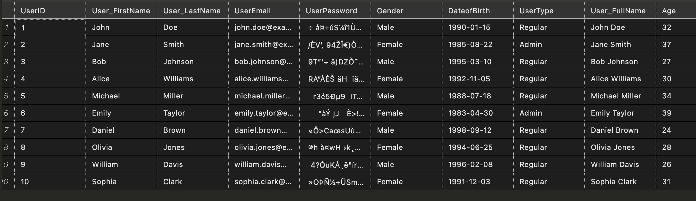
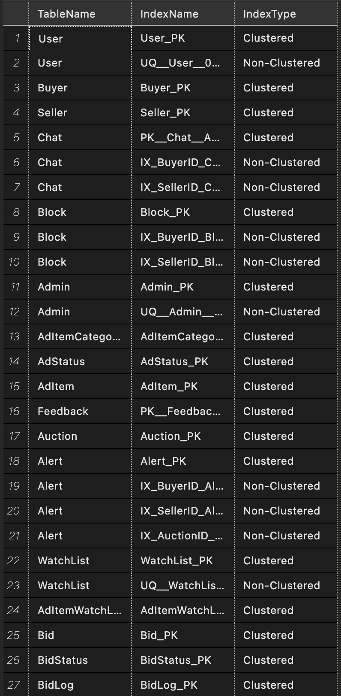
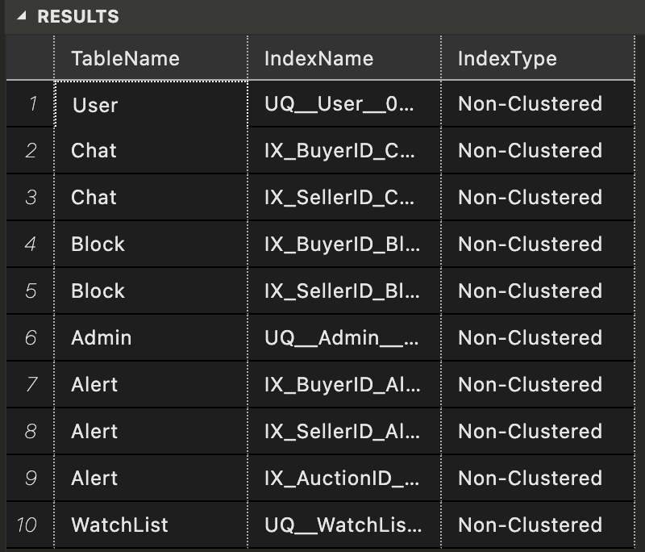
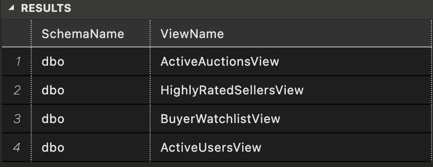
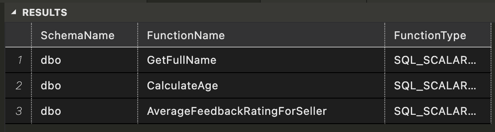
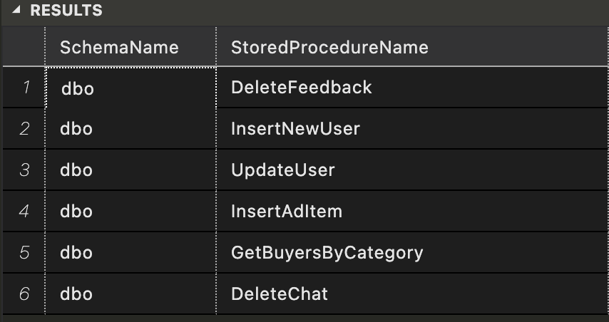
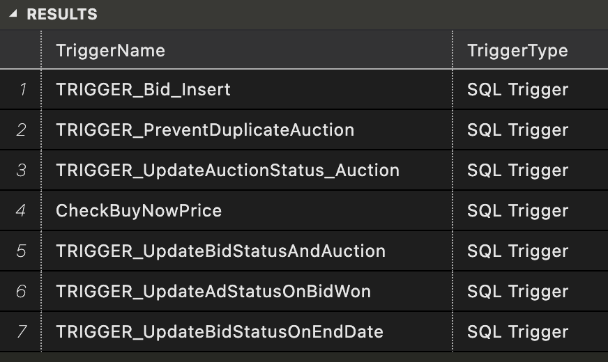

## Bidding System

List of tables, views, stored procedures, triggers, UDFs, and indices with screenshots.

### Implementation Details

| Object Type                        | Quantity or Comments | Yes/No |
| ---------------------------------- | -------------------- | ------ |
| Tables                             | 17                   | Yes    |
| Views                              | 6                    | Yes    |
| Table Level Check Constraint       | 6                    | Yes    |
| Computed Column based on UDF       | 2                    | Yes    |
| Non-Clustered Indexes              | 14                   | Yes    |
| Stored Procedures                  | 6                    | Yes    |
| User Defined Functions (UDF)       | 3                    | Yes    |
| DML Triggers                       | 7                    | Yes    |
| Column Data Encryption             | 2                    | Yes    |
| BI Data Visualization              | Yes                  | Yes    |
| GUI for CRUD Operations (optional) | No                   | No     |
| Other                              |                      |        |


## DDL Results

```sql
SELECT 
  NAME, 
  [OBJECT_ID], 
  TYPE_DESC, 
  CREATE_DATE, 
  MODIFY_DATE 
FROM SYS.TABLES;
```


## Sample Data Results

```sql
SELECT TOP 10 * FROM [dbo].[User];
```



## Clustered Indices

```sql
-- Clustered Indexes
SELECT 
    t.name AS TableName,
    i.name AS IndexName,
    CASE WHEN i.type_desc = 'CLUSTERED' THEN 'Clustered' ELSE 'Non-Clustered' END AS IndexType
FROM 
    sys.indexes i
INNER JOIN 
    sys.tables t ON i.object_id = t.object_id
WHERE 
    i.index_id > 0; -- Excluding system-generated indexes
```



## Non-Clustered Indices

```sql
-- Non-Clustered Indexes
SELECT 
    t.name AS TableName,
    i.name AS IndexName,
    'Non-Clustered' AS IndexType
FROM 
    sys.indexes i
INNER JOIN 
    sys.tables t ON i.object_id = t.object_id
WHERE 
    i.index_id > 0 -- Excluding system-generated indexes
    AND i.type_desc = 'NONCLUSTERED';
```



## Views

```sql
USE BIDDING_SYSTEM;

SELECT 
    schema_name(schema_id) AS SchemaName,
    name AS ViewName
FROM 
    sys.views;
```



## UDFs

```sql

USE BIDDING_SYSTEM;

SELECT 
    schema_name(schema_id) AS SchemaName,
    name AS FunctionName,
    type_desc AS FunctionType
FROM 
    sys.objects
WHERE 
    type_desc = 'SQL_SCALAR_FUNCTION' -- Filter for scalar-valued functions
    OR type_desc = 'SQL_TABLE_VALUED_FUNCTION'; -- Filter for table-valued functions
```



## Stored Procedures

```sql
USE BIDDING_SYSTEM; 

SELECT 
    schema_name(schema_id) AS SchemaName,
    name AS StoredProcedureName
FROM 
    sys.procedures;

```



## Triggers

```sql
USE BIDDING_SYSTEM;

SELECT 
    o.name AS TriggerName,
    CASE 
        WHEN o.type = 'TR' THEN 'SQL Trigger'
        ELSE 'Other Trigger Type'
    END AS TriggerType
FROM 
    sys.objects o
WHERE 
    o.type IN ('TR', 'TA');
```



