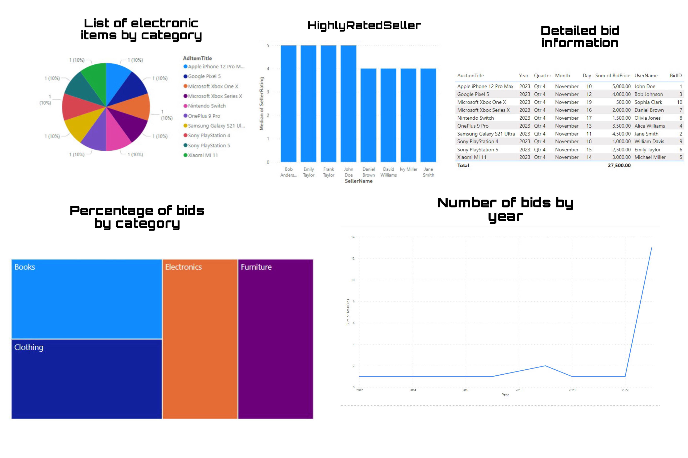

# Project Group 6

## Introduction of Bidding System on system like Facebook Marketplace

Introducing a bidding feature to the existing Facebook marketplace.

## Group Members 

- Rohith Kumar Reddy Kota
- Nikhil Godalla
- Shreya Jayesh Thakur
- Siddhartha Ravilla
- Rehan Khan

[P1. Topic & Objectives: Introduction of Bidding System on Facebook Marketplace](P1.%20Topic%20&%20Objectives.md)

[P2. Database Design, Initial ERD](P2.%20Database%20Design%2C%20Initial%20ERD.md)

[P3. Final ERD](P3.%20Final%20ERD.md)

[P4. Implementation - Database Objects With Screenshots](P4.%20Implementation.md)

> See theimplementation/database` folder for [sql scripts](implementation/database)

### Implementation Details

| Object Type                        | Quantity or Comments | Yes/No |
| ---------------------------------- | -------------------- | ------ |
| Tables                             | 17                   | Yes    |
| Views                              | 6                    | Yes    |
| Table Level Check Constraint       | 6                    | Yes    |
| Computed Column based on UDF       | 2                    | Yes    |
| Non-Clustered Indexes              | 14                   | Yes    |
| Stored Procedures                  | 6                    | Yes    |
| User Defined Functions (UDF)       | 3                    | Yes    |
| DML Triggers                       | 7                    | Yes    |
| Column Data Encryption             | 2                    | Yes    |
| BI Data Visualization              | Yes                  | Yes    |
| GUI for CRUD Operations (optional) | No                   | No     |
| Other                              |                      |        |

> Note: See [P4. Implementation](P4.%20Implementation.md) for more details and results.

## Dashboard 

 
